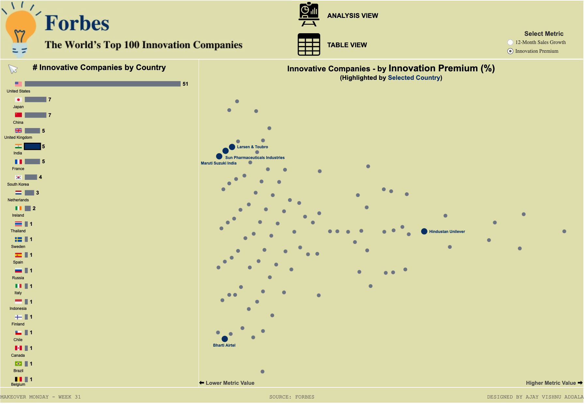

# World's Top 100 Innovative Companies Dashboard

This Tableau dashboard analyzes the world's top 100 innovative companies as published by Forbes. The dataset includes the following metrics:

- Rank
- Company Name
- Country
- 12-Month Sales Growth (%)
- Innovation Premium (%)

## Dashboard Overview

[View the interactive Tableau dashboard here](https://public.tableau.com/views/WorldsTop100InnovationCompanies/AnalysisView?:language=en-US&:sid=&:redirect=auth&:display_count=n&:origin=viz_share_link)

### Features

- **Beeswarm Chart:** 
  - Allows viewers to switch between sales growth and innovation premium metrics.
  - Highlights and labels companies from a selected country.

- **Bar Chart:**
  - Displays the number of innovative companies by country, with the United States leading with 51 companies.

- **Interactive Table View:**
  - Provides an option to switch to a table view for detailed data inspection.

## Files Included

- Tableau workbook file.
- Original dataset used for the analysis.
- Snapshot of the Tableau dashboard.

